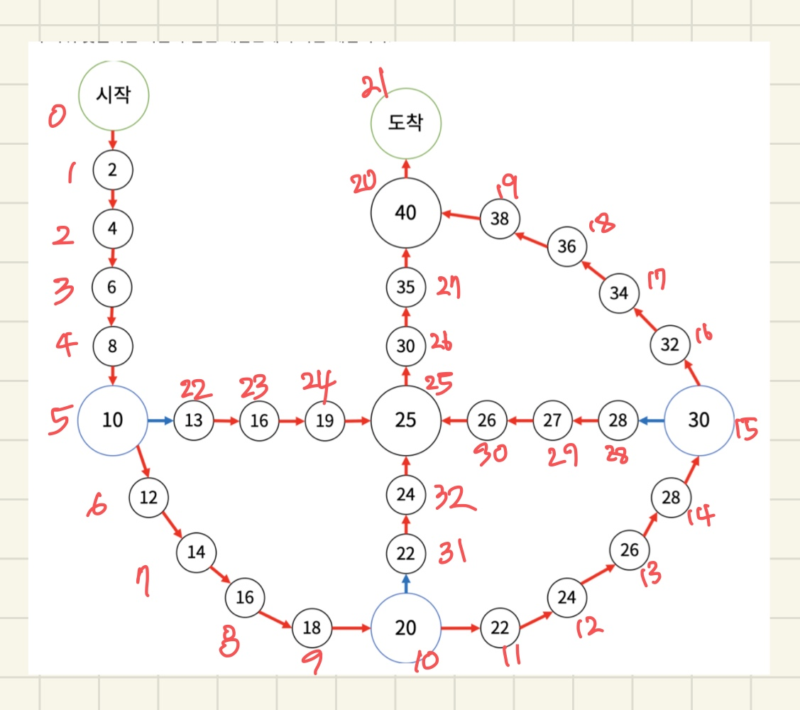

# 문제 정의

1. 처음 시작 칸에 말 4개가 있다.
2. 말은 게임판에 그려진 화살표의 방향대로만 이동할 수 있다. 말이 10, 20, 30칸에서 시작하면 파란색 화살표를 타야하고 이외에는 빨간색 화살표를 타야 한다. 말이 도착지에 도착하면 이동을 마친다.
3. 게임은 10개의 턴으로 구성돼고, 한 턴당 1~5까지 적힌 주사위 수에 따라 말이 이동한다. 말이 이동하려는 칸에 다른 말이 있으면 이동이 불가. 도착지는 상관 없음
4. 말이 이동을 마칠때마다 칸에 적힌 수가 추가된다. 얻을 수 있는 점수의 최대값을 구해라

# 문제 풀이

1. 맵을 위와같이 0~32까지 인덱스로 표시.
    - 현재 위치에서 다음에 갈 idx를 저장하는 path[] 생성
    - 10, 20, 30일 때 전환될 방향을 저장하는 corner[] 생성
    - 말들의 현재 위치(idx)를 저장할 horse[] 생성
    - 각 인덱스의 점수를 저장할 score[]  생성
2. 말은 총 4마리로 모든 말들이 움직이는 경우를 dfs로 완탐
3. 현재 말의 위치, 도착할 말의 위치 저장
4. 말이 10, 20, 30에서 시작하면 방향전환을 해주고, 아니면 현재 위치에서 말을 이동
5. 도착한 말의 위치에 이미 다른 말이 있으면 continue
6. 이전 말의 위치, 이동한 말의 위치 방문처리, dfs 호출

# 정리

말이 4개밖에 없고 게임이 10턴이니까 충분히 브루트포스로 풀 수 있겠다 싶었다. 그런데 맵을 어떻게 저장할지 생각하는게 정말 힘들었다. 처음에는 점수를 기준으로 배열을 생성했다가 말들의 이동 처리가 너무 힘들어졌다. 결국 원래 코드를 싹 지우고 어떤 블로그를 참고해서 인덱스를 기준으로 맵을 저장하는 방법으로 바꿔서 다시 짰다. 완탐 로직 자체는 어렵지 않았지만 맵을 구현하는게 너무 힘든 문제였다ㅜ