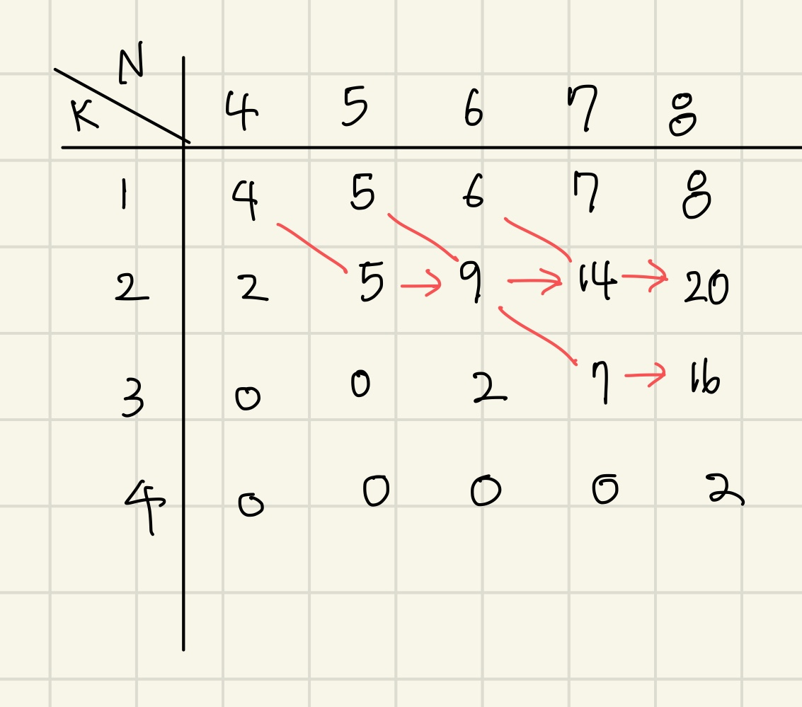

# 문제 정의

1. N개의 색 중 인접하지 않은 K개를 뽑는 개수를 구하시오
2. 4 ≤ N ≤ 1000, 1 ≤ K ≤ N

# 문제 풀이

1. dp문제
2. n개 중  k개를 뽑는 경우는 현재 n번째 색: n-1번째  색을 뽑고 n을 안뽑는 경우 + n-2번째 색을 뽑고 n을뽑는 경우
3. 점화식으로 dp[n][k] = dp[n-1][k] + dp[n-2][k-1]
4. n개에서 1개를 뽑을 땐 무조건 n개의 경우의 수가 나오므로 처음에 dp[i][1] = i (1≤ i ≤ N)으로 초기화해야 한다.

# 정리

정말 이해가 안돼서 블로그 보고 겨우 풀었다. 내 실력으로 푼게 아니라 나중에 다시 풀어봐야지. 테이블로 그려서 푸니까 왜 dp[n][1]가 n이 되는지 이해가 됐다. 앞으로 dp문제는 테이블을 꼭 그려야지!