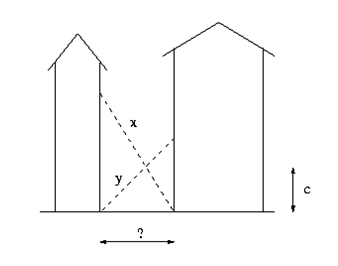
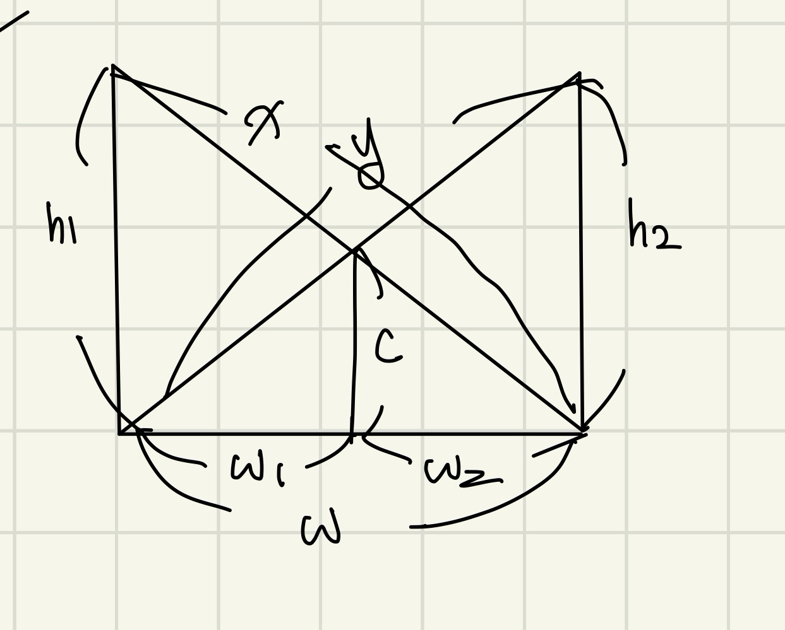
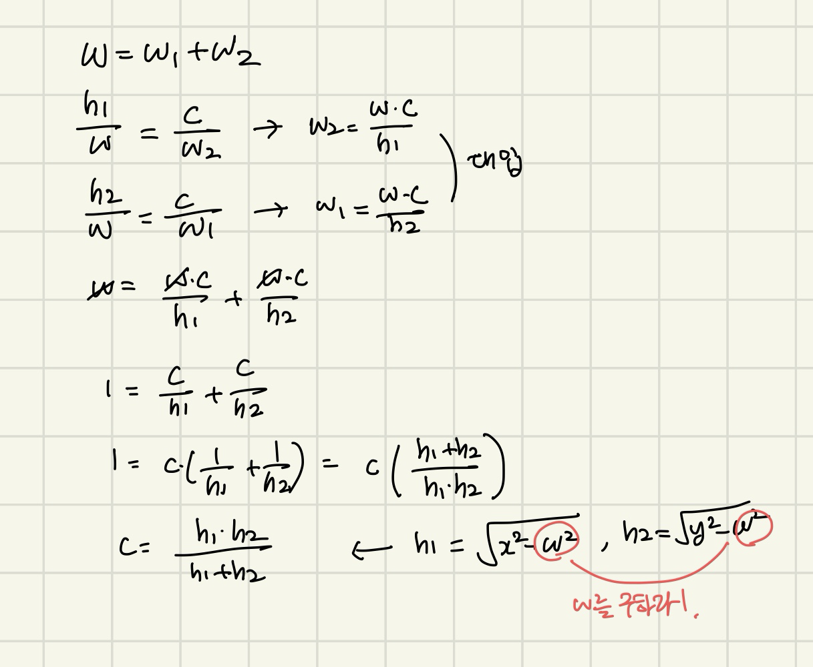

# 문제 정의

1. 빌딩 사이에 두 개의 사다리가 다음과 같은 모양으로 기대져 있다.

1. x, y, c에 해당하는 양의 실수 세 개가 입력된다. 두 빌딩사이의 너비를 구하시오. 절대/상대 오차는 10^-3까지 허용된다.

# 문제 풀이

1. c가 주어지므로 w의 값을 이분탐색으로 추정한다
2. left = 0, right = min(x, y)
3. mid로 (h1*h2)/(h1+h2)를 구한 값이 c보다 크면 _c를 줄여줘야 한다. 여기서 까다로운 게 h1, h2의 값을 줄이려면 w가 커져야 하므로 원래 이분탐색과는 반대로 mid를 키워줘야 한다. 
    - findC(mid) ≥ c: low = mid + 0.0001
    - else: high = mid - 0.0001

# 정리

피타고라스 정리로 풀릴줄 알았는데 안돼서 한참 헤맸다. 이게 왜 이분탐색이 되는지 이해가 안갔는데 공식을 유도해보니까 이분탐색으로밖에 풀 수 없는 문제였다. 그리고 실수에서 이분탐색은 처음이라 매우 어려웠다ㅠㅠ